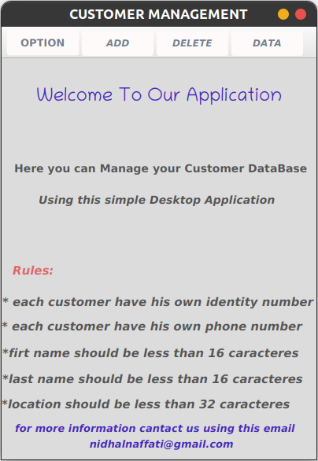
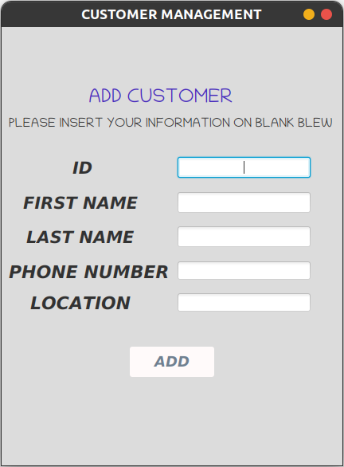
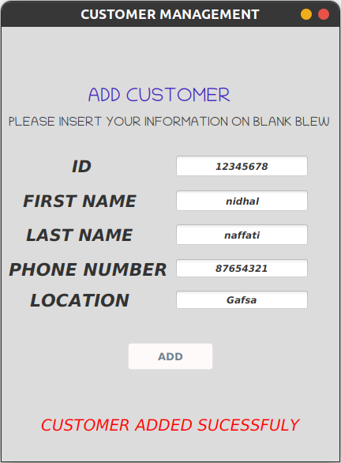
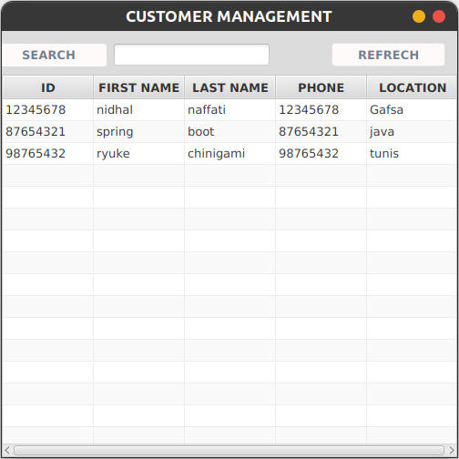

# JavaFx & MySQl Project

This is a simple JavaFX project aiming to do some local registration of some data from "CUSTOMERS" in our database.

#### In this app we used :

* JavaFX for the GUI
* MySQL as a DataBase
* JDBC to connect and execute our queries with the database. 
* Java for doing backend stuff and handle exceptions.

### Requirement:

* java 
    * install java in your machine using this link:
      https://www.oracle.com/java/technologies/javase/jdk11-archive-downloads.html

* Mysql
    * Install MySQL from this link : https://dev.mysql.com/downloads/installer/

    * Modify the DataBaseConnection Class (put your database name,user and the password).

    * You don't have to worry about database creation & table creation both should be created automatically when the application starts.

  
* Enjoy the Application

###  Some screenshots: 

